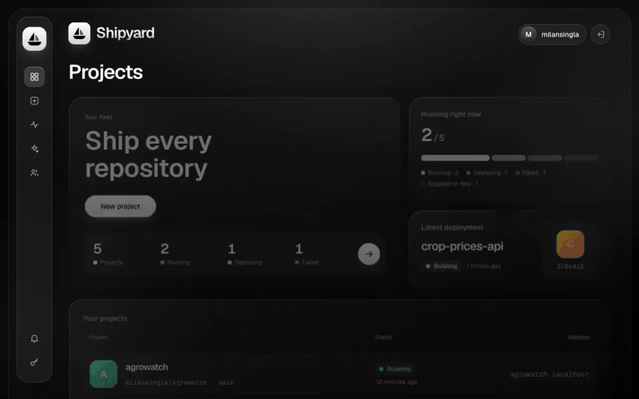
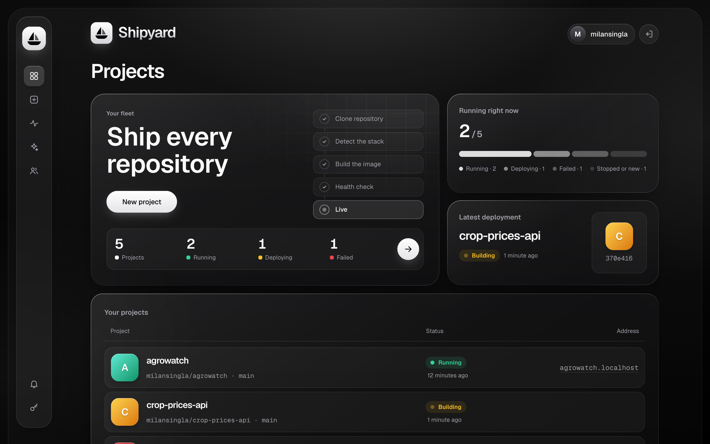
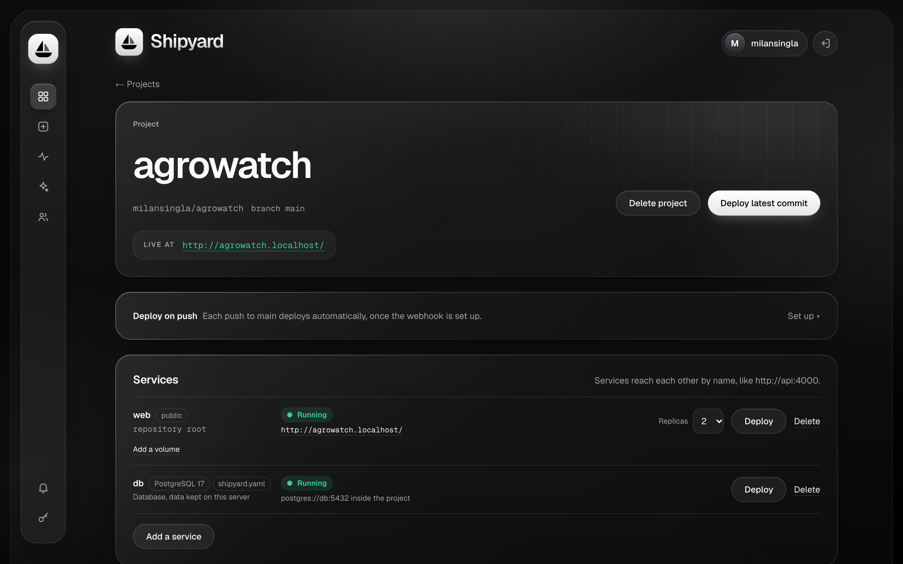
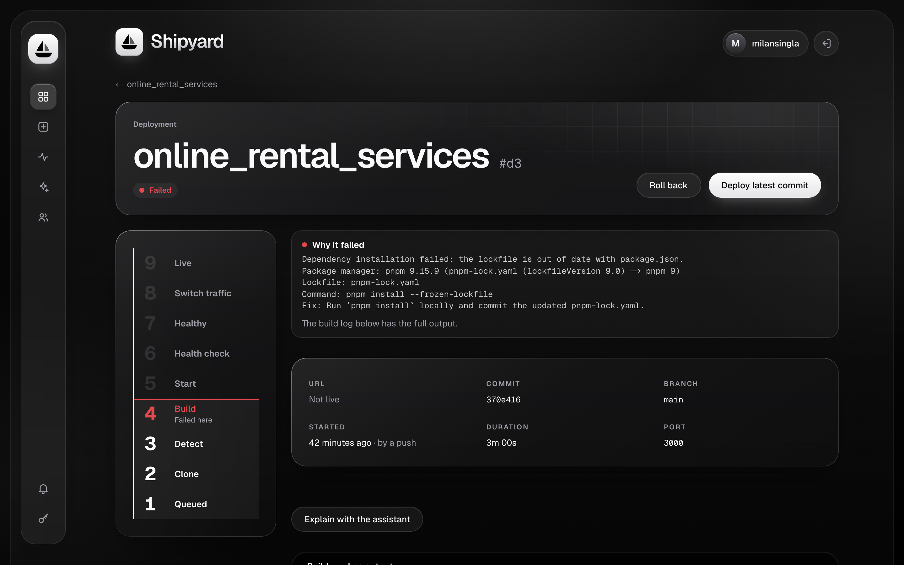
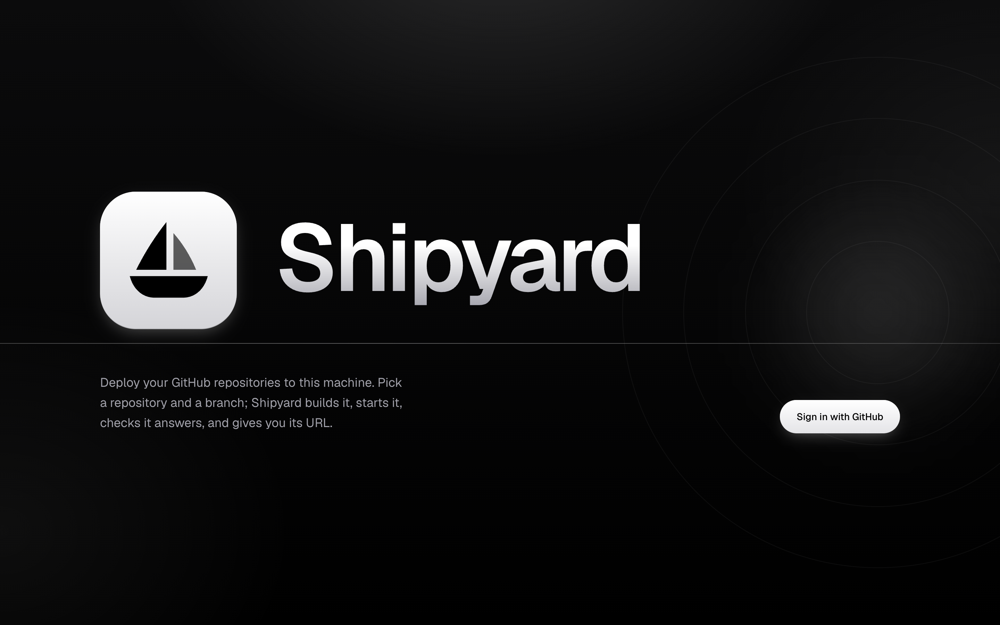
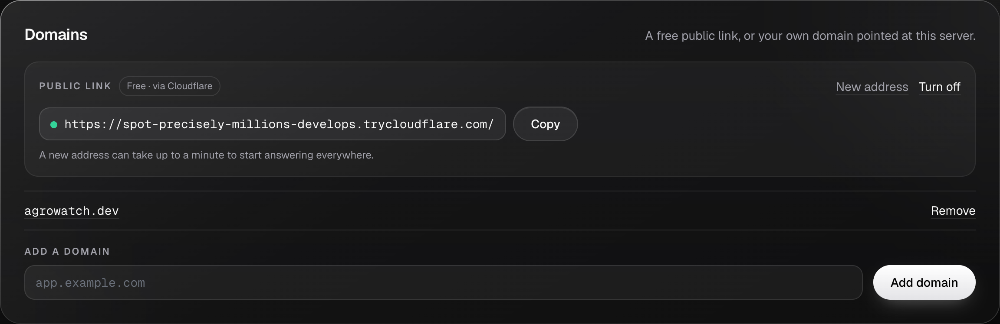
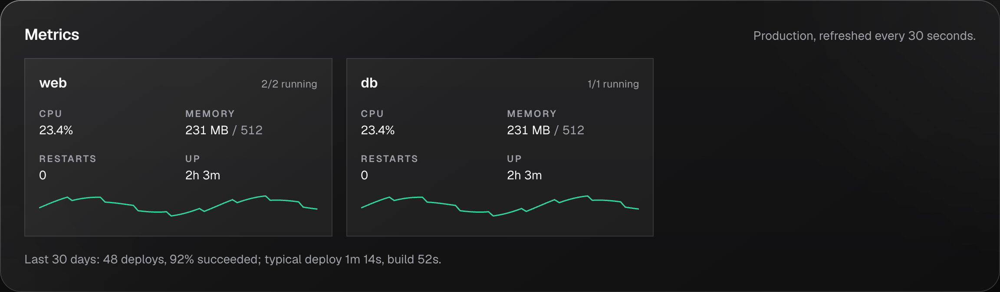
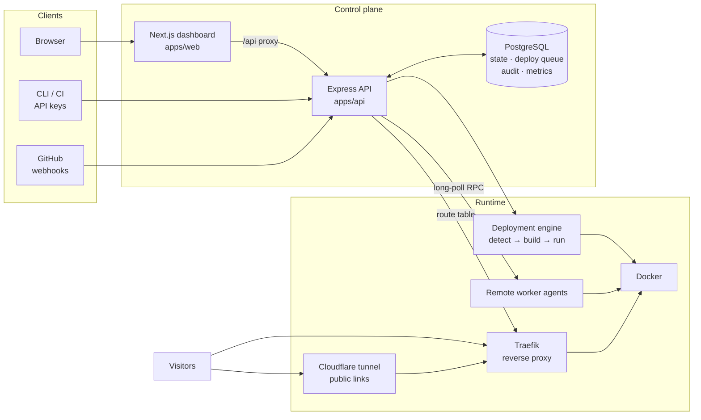
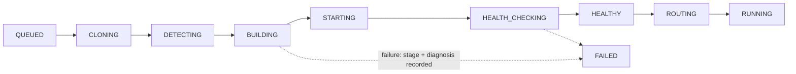

<div align="center">


# Shipyard

**A self-hosted deployment platform: a small Vercel/Render you can run on your own machines and read end to end.**

Connect a GitHub repository → Shipyard detects the stack, builds it, runs it, health-checks it, and serves it at a stable URL with zero-downtime redeploys.

[](https://github.com/milansingla/shipyard/actions/workflows/ci.yml)
[](LICENSE)




</div>

---

## Why this project

Platforms like Vercel and Render make deploying feel like magic. Shipyard rebuilds that magic in the open, as one TypeScript codebase small enough to understand: how a repository becomes a container, how traffic moves between versions with no downtime, how a deploy queue survives a crashed worker, and how access control, secrets and audit trails fit around it.

The scope is real-world: **~24,600 lines of TypeScript**, a **27-model PostgreSQL schema** with 28 migrations, **639 unit tests**, and **156 integration tests** that drive the real Docker daemon, Traefik and PostgreSQL.

## Highlights

| | |
| --- | --- |
| 🔍 **Detects any common stack** | Node.js (npm / pnpm / yarn / bun, workspaces, Turborepo), Next.js, Nuxt, SvelteKit, Astro, NestJS, Vite/React/Vue/Angular, Python (FastAPI, Flask, Django), PHP/Laravel, Go, Java, Rust, static HTML. It generates a production Dockerfile, or uses yours |
| 🚦 **Zero-downtime deploys** | Traefik switches traffic only once the new version passes its health check; one-click rollback; rolling updates across replicas |
| 🧠 **Failures explained** | "Dependency installation failed: the lockfile is out of date…", with the cause, the fix and the tool's own error, instead of `exit code 1`. An optional AI assistant diagnoses from logs, read-only |
| 🌍 **Free public links** | one click gives a running app a public `https://….trycloudflare.com` URL through a Cloudflare tunnel: no domain, DNS or router setup |
| 🧩 **Multi-service projects** | web, workers and managed PostgreSQL on a private network, persistent volumes, cron jobs, `shipyard.yaml` config-as-code |
| 🌱 **Environments** | production, a development environment and a preview per pull request, each with its own variables |
| 🖥️ **Scales across machines** | worker agents, a PostgreSQL-backed deploy queue with leases, scheduling by capacity, and recovery of lost workers |
| 🔐 **Governance** | GitHub OAuth, organizations and teams, OWNER/ADMIN/DEVELOPER/VIEWER roles, scoped API keys, service accounts, policies, production approvals, audit log, encrypted secrets |
| 📈 **Operations** | metrics, alerts to Slack and webhooks, backups with tested restores, live logs over SSE, and a CLI for CI pipelines |

## Screenshots

| Projects | Project |
| --- | --- |
|  |  |
| **Failure diagnosis** | **Sign in** |
|  |  |
| **Free public link** | **Live metrics** |
|  |  |

<sub>Screenshots use sample data.</sub>

## Architecture



**A deployment, step by step**



- **One source of truth.** Every decision (who may do what, which worker, which version receives traffic) is made by the API and recorded in PostgreSQL.
- **The queue is the database.** Workers claim jobs with `FOR UPDATE SKIP LOCKED`, hold 60-second leases, and a lost worker's job is retried only if nothing had started.
- **Traffic follows health.** A new version gets traffic only after it answers its health check; the old one keeps serving until then.

More in [docs/architecture.md](docs/architecture.md) and [docs/deployment-engine.md](docs/deployment-engine.md).

## Tech stack

| Layer | Technology |
| --- | --- |
| Dashboard | Next.js 16 (App Router), React 19, Tailwind CSS 4, TypeScript |
| API & engine | Node.js, Express 5, TypeScript (strict), Zod validation, Pino logging |
| Data | PostgreSQL 17, Prisma 7 ORM, 28 migrations |
| Containers & routing | Docker (dockerode), Traefik v3, Let's Encrypt, Cloudflare quick tunnels |
| Auth & security | GitHub OAuth, hashed API keys, AES-256-GCM encrypted secrets, CSRF origin checks, rate limiting |
| Testing | Vitest: unit tests plus integration tests against real Docker, Traefik and PostgreSQL |
| Tooling | npm workspaces monorepo, GitHub Actions CI, a CLI (`shipyard`) |

## Quick start

**Requirements:** Node.js ≥ 22.12 · npm ≥ 10 · Docker Desktop (running) · git

```bash
git clone https://github.com/milansingla/shipyard.git
cd shipyard
npm install
cp .env.example .env      # every variable has a safe default
npm run db:up             # PostgreSQL (127.0.0.1:5433) and Traefik (127.0.0.1:80) in Docker
npm run db:deploy         # apply the database migrations
```

Set up GitHub sign-in once (about 2 minutes): create a GitHub OAuth App and fill `GITHUB_CLIENT_ID`, `GITHUB_CLIENT_SECRET`, `SHIPYARD_SECRET_KEY` and `SHIPYARD_ALLOWED_GITHUB_USERS` in `.env`. The steps are in [docs/github.md](docs/github.md#setup).

```bash
npm run dev:api   # terminal 1: API on http://localhost:4000
npm run dev:web   # terminal 2: dashboard on http://localhost:3000
```

Open <http://localhost:3000>, sign in with GitHub, choose **New project**, pick a repository, and **Create and deploy**. Once it's running, the app lives at `http://<project>.localhost` and keeps that address across redeploys. Try it with the sample app in [`examples/hello-node`](examples/hello-node).

> Your app should listen on `0.0.0.0` and on the port in `$PORT`. Shipyard sets `$PORT` for you.

## CLI

Create an API key in the dashboard (**API keys**), then:

```bash
npm run shipyard -- login --url http://localhost:3000 --token shp_…
npm run shipyard -- deploy shop            # streams the build; exits 0 once live, 1 on failure
npm run shipyard -- status shop
npm run shipyard -- logs shop --follow     # app output; --build for the build log
npm run shipyard -- rollback shop
npm run shipyard -- env shop set DATABASE_URL=postgres://… --secret
```

In CI, set `SHIPYARD_URL` and `SHIPYARD_TOKEN` instead of logging in. See [docs/cli.md](docs/cli.md).

## API

A REST API under `/api/v1` with session or API-key authentication: 100+ endpoints covering projects, deployments, logs (SSE), services, environments, domains, public links, cron, teams, policies, alerts, the AI assistant and workers.

```bash
curl -H "Authorization: Bearer $SHIPYARD_TOKEN" http://localhost:4000/api/v1/projects
```

**Full reference: [docs/api.md](docs/api.md)**

## Testing

```bash
npm test                  # unit tests: fast, no Docker or network needed (run in CI)
npm run test:integration  # real Docker, Traefik, PostgreSQL and network
npm run typecheck
```

Integration tests deploy real fixture apps (Node, pnpm workspaces, Python, Go, PHP, static sites), route them through a real Traefik, and even reach an app from the internet through a Cloudflare tunnel.

## Project structure

```
apps/
  api/                 Express API, deployment engine, worker agent, CLI (local)
    prisma/            schema + migrations
    src/modules/       HTTP routes + business rules (projects, deployments, access, …)
    src/services/      git, docker, detection, build, routing, tunnels, workspace
    test/              unit tests, integration tests, fixture apps
  web/                 Next.js dashboard (proxies /api to the API)
  cli/                 the `shipyard` CLI (talks to /api/v1)
docs/                  architecture, engine, API reference, security, operations, …
examples/hello-node/   a sample app to deploy
docker-compose.yml     PostgreSQL + Traefik for development
docker-compose.production.yml   HTTPS (Let's Encrypt) override
```

## Engineering decisions

- **Correctness over cleverness in builds.** Installs are always frozen when a lockfile exists, and never silently relaxed. A stale lockfile is reported before Docker runs, and explained if the install fails.
- **Untrusted input everywhere.** Repository content is treated as hostile: no symlink following, size-capped reads, validated paths, and commands passed in exec form so they can't inject Dockerfile instructions.
- **Secrets never leave encrypted storage.** Variables are encrypted with AES-256-GCM, never returned by the API, and never baked into images. API keys are stored as SHA-256 hashes and shown only once.
- **Least privilege by default.** Roles are checked on every request; API keys can be narrowed to read or deploy; the AI assistant uses read-only tools within the caller's permissions.
- **Operability built in.** Every status change, who caused it and why is recorded; failures carry their stage and a human explanation; metrics, alerts and backups ship with the platform.

Deeper write-ups: [security](docs/security.md) · [routing](docs/routing.md) · [workers](docs/workers.md) · [learning notes](docs/learning-notes.md)

## Documentation

| Topic | |
| --- | --- |
| [Architecture](docs/architecture.md) | components and why they are split this way |
| [Deployment engine](docs/deployment-engine.md) | pipeline, detection, Dockerfile generation, health checks |
| [API reference](docs/api.md) | every endpoint |
| [Routing](docs/routing.md) | Traefik, stable hostnames, zero downtime, custom domains, public links |
| [Services](docs/services.md) · [Databases](docs/databases.md) | multi-service projects, volumes, managed PostgreSQL |
| [Configuration as code](docs/configuration.md) | `shipyard.yaml` |
| [Environments](docs/environments.md) · [Variables & secrets](docs/environment.md) | dev, previews, encrypted config |
| [Cron jobs](docs/cron.md) | scheduled commands with recorded runs |
| [Access control](docs/rbac.md) · [Teams](docs/teams.md) | roles, teams, service accounts, API key scopes |
| [Workers](docs/workers.md) | multi-machine scheduling, queue and leases |
| [Observability](docs/observability.md) · [Operations](docs/operations.md) | metrics, alerts, backups, restore, cleanup |
| [AI assistant](docs/ai.md) | what it can and can't do |
| [GitHub](docs/github.md) · [CLI](docs/cli.md) · [Dashboard](docs/dashboard.md) | sign-in setup, CLI, UI |
| [Security](docs/security.md) | threat model |
| [Learning notes](docs/learning-notes.md) | concepts behind each milestone |

## Versions

| Version | Theme |
| --- | --- |
| **5.0.0** | multi-machine platform: workers, deploy queue, metrics, alerts, backups, governance, AI assistant, any-stack detection, public links, new dashboard |
| 4.0.0 | developer platform: CLI, API keys, multi-service projects, databases, replicas, cron, environments, previews |
| 3.0.0 | production platform: state machine, secrets, rollback, live logs, HTTPS, custom domains |
| 2.0.0 | first complete version: GitHub sign-in, detection, dashboard, webhooks, Traefik routing |

Details in [CHANGELOG.md](CHANGELOG.md).

## License

[MIT](LICENSE) © 2026 Milan Singla
